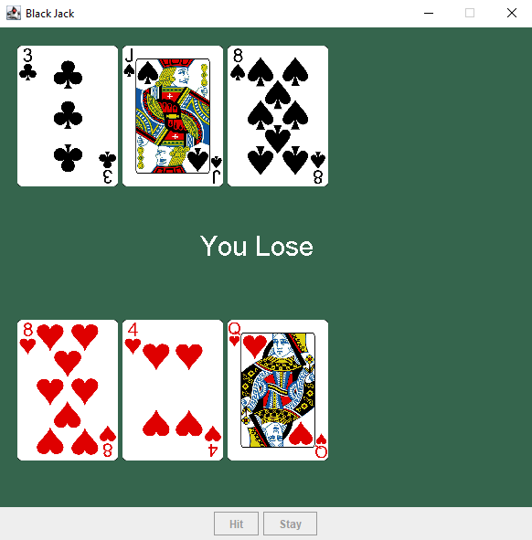

# BlackJack
Projeto de um jogo de BlackJack (21) desenvolvido em Java, utilizando Java Swing para a criação da interface gráfica.  O projeto foi desenvolvido como forma de praticar conceitos de programação, orientação a objetos, manipulação de listas, eventos de interface gráfica e lógica de jogos.

## Sobre o projeto

O jogo simula uma partida de **BlackJack** entre o jogador e o dealer.
No início da partida, um baralho completo é criado e embaralhado. O jogador e o dealer recebem suas cartas, sendo que uma das cartas do dealer permanece escondida até o jogador escolher **Stay**.
O objetivo é chegar o mais próximo possível de **21 pontos**, sem ultrapassar esse valor.

## Demonstração

### Partida


### Resultado



## Como jogar

O jogo possui dois botões:

* **Hit** — recebe uma nova carta.
* **Stay** — encerra a jogada do jogador e faz o dealer comprar cartas até atingir pelo menos 17 pontos.

### Resultado da partida

* Se o jogador ultrapassar 21 pontos, ele perde.
* Se o dealer ultrapassar 21 pontos, o jogador vence.
* Se ambos ficarem abaixo ou iguais a 21, a maior pontuação vence.
* Se jogador e dealer tiverem a mesma pontuação, ocorre um empate.

### Valores das cartas

* **Ás (A)** → começa valendo 11 pontos, podendo ser reduzido para 1 quando necessário.
* **J, Q e K** → 10 pontos.
* **2 a 10** → valor correspondente ao número da carta.

## Tecnologias utilizadas

* **Java**
* **Java Swing**
* **Java AWT**
* **ArrayList**
* **Random**
* Programação Orientada a Objetos

## Conceitos praticados

Durante o desenvolvimento do projeto foram utilizados conceitos como:

* Classes e objetos
* Métodos
* Estruturas condicionais
* Estruturas de repetição
* `ArrayList`
* `ActionListener`
* Interfaces gráficas com `JFrame`, `JPanel` e `JButton`
* Manipulação de imagens
* Geração de números aleatórios
* Lógica de pontuação
* Tratamento do valor do Ás no BlackJack
* Separação entre a classe de inicialização e a classe principal do jogo

## Estrutura do projeto

```text
BlackJack-Java/
├── src/
│   ├── App.java
│   ├── BlackJack.java
│   └── cards/
│       ├── A-C.png
│       ├── A-D.png
│       ├── A-H.png
│       ├── A-S.png
│       ├── ...
│       └── BACK.png
├── screenshot.png
├── screenshot2.png
├── .gitignore
└── README.md
```

### Principais classes

**`App.java`**

É o ponto de entrada do programa. Sua função é iniciar uma nova partida criando uma instância da classe `BlackJack`.

```java
public class App {
    public static void main(String[] args) {
        BlackJack blackJack = new BlackJack();
    }
}
```

**`BlackJack.java`**

Contém a maior parte da lógica do jogo, incluindo:

* Criação do baralho
* Embaralhamento das cartas
* Distribuição das cartas
* Controle da mão do jogador e do dealer
* Cálculo das pontuações
* Tratamento do Ás
* Interface gráfica
* Eventos dos botões `Hit` e `Stay`
* Verificação do resultado da partida

**`cards/`**

Contém as imagens utilizadas para representar as cartas na interface gráfica. A imagem `BACK.png` é utilizada para representar a carta escondida do dealer.

## Como executar

### 1. Clone o repositório

```bash
git clone https://github.com/Marcaoo/BlackJack.git
```

### 2. Abra o projeto

Abra o projeto em uma IDE compatível com Java, como:

* IntelliJ IDEA
* Eclipse
* Visual Studio Code

### 3. Verifique os recursos

Certifique-se de que a pasta `cards` esteja dentro de `src` e contenha todas as imagens utilizadas pelo jogo.

As imagens `screenshot.png` e `screenshot2.png` são utilizadas apenas para demonstrar o funcionamento do projeto no README.

### 4. Execute o programa

Execute a classe:

```text
App.java
```

A classe `App` irá criar uma nova instância de `BlackJack`, iniciando o jogo e exibindo a interface gráfica.

## Objetivo do projeto

Este projeto faz parte dos meus estudos em **Ciência da Computação** e foi desenvolvido para colocar em prática conceitos de **Java, programação orientada a objetos, interfaces gráficas e lógica de programação** através da criação de um jogo.

## Autor

**Marco Antônio de Oliveira**

Estudante de **Ciência da Computação**, com foco em desenvolvimento de software e experiência prática em projetos utilizando Java, Python e C++.

## 📌 Status do projeto

🟢 **Concluído**

O projeto apresenta uma implementação funcional de BlackJack, com interface gráfica, criação do baralho e embaralhamento das cartas, controle das mãos do jogador e do dealer, cálculo de pontuação e tratamento do Ás.

